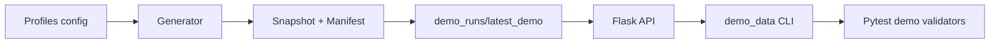
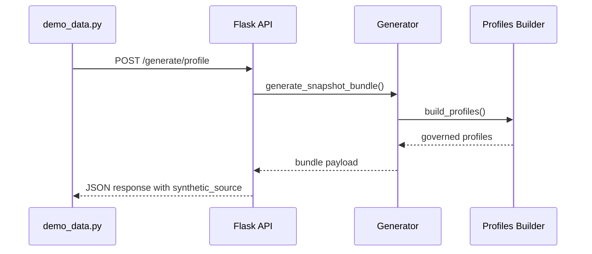

# Enterprise Synthetic Data Hub (POC)

## Project Overview
The Enterprise Synthetic Data Hub is a two-week proof of concept for CSAA / Mobilitas. It delivers an enterprise-aligned foundation for generating privacy-safe synthetic data that represents Persons, Vehicles, and derived Profiles. The focus is on scaffolding, governance, and prompt-driven collaboration so future human and LLM contributors can extend the solution quickly.

## Demo Safety Notice
- The Flask API is **demo-only**: there is no authentication, authorization, or rate limiting, and it should not be exposed beyond a controlled demo environment.
- The experience optimizes for determinism (governed seeds, fixed schemas) over scale; it has **not** been hardened for production traffic or data residency requirements.
- If a live demo environment is unavailable, use the canned payloads under `data/demo_samples/phase1/` as a drop-in backup for walkthroughs and slides.

## 🚀 5-Minute Demo (Zero Knowledge Required)
### Unix/macOS
git clone https://github.com/dutchsloot84/enterprise-synthetic-data-hub.git
cd enterprise-synthetic-data-hub
bash scripts/bootstrap_and_demo.sh

One-liner (Recommended):

curl -sSL https://github.com/dutchsloot84/enterprise-synthetic-data-hub/releases/latest/download/bootstrap_and_demo.sh | bash

### Windows PowerShell
git clone https://github.com/dutchsloot84/enterprise-synthetic-data-hub.git
cd enterprise-synthetic-data-hub
./scripts/bootstrap_and_demo.ps1

One-liner (Recommended):

iwr "https://github.com/dutchsloot84/enterprise-synthetic-data-hub/releases/latest/download/bootstrap_and_demo.ps1" | iex

### Refreshing the bootstrap distribution
- Ensure a GitHub release exists (v0.1.0+). The assets are published to `releases/latest/download/*`.
- With the GitHub CLI available and `GH_TOKEN`/`GITHUB_TOKEN` set, run `bash scripts/publish_bootstrap_assets.sh` (or `./scripts/publish_bootstrap_assets.ps1` on Windows) to upload the latest installers.
- Alternatively, trigger the **Publish Bootstrap Assets** workflow in GitHub Actions.

### Docker / Devcontainer
- `docker build -t esdh-demo .`
- `docker run --rm -p 5000:5000 esdh-demo ./scripts/docker_run_demo.sh`
- `docker run --rm -p 5000:5000 esdh-demo ./scripts/docker_run_demo.sh --skip-smoke` (faster dry run)
- (Optional) open the repo in VS Code / Codespaces to reuse `.devcontainer/devcontainer.json` which installs dependencies and runs `make demo-smoke` automatically.

Each bootstrap flow installs dependencies, runs `make demo`, and guides you through:
- Snapshot generation driven by a demo profile (`config/demo.yaml`).
- Automated Flask API startup with `/healthz` verification.
- `scripts/demo_data.py` preview (generator vs. API mode) with Rich formatting.
- Optional `pytest -m demo` smoke tests to prove the CLI/API contracts still hold.

The `bootstrap_and_demo.*` scripts now detect whether they are being run interactively or via a piped one-liner so they can print safe prompts, validate prerequisites (Python, pip, git, curl/wget/iwr, `config/demo.yaml`), and always use `python -m pip` for deterministic installs.

## Demo Profiles
- Profiles live in `config/demo.yaml`. The repo ships with:
  - `baseline` – 30 records, deterministic seed 42.
  - `heavy` – 200 records, randomized for storytelling.
- Pick a profile via:
  - `DEMO_PROFILE=heavy make demo`
  - `python scripts/demo_data.py --profile heavy --preview 3`
  - `DEMO_PROFILE=baseline python scripts/demo_validate.py`
- Override ports for the API bootstrap with `DEMO_API_PORT=5051 make demo` when port 5000 is busy.
- Inspect the governing settings at any time via `make demo-profile-info` or `python -m enterprise_synthetic_data_hub.cli.profile_info --profile heavy --json` to view record counts, seeds, API defaults, and the payload field list.

## Synthetic Governance
- Every Person, Vehicle, and Profile now includes `synthetic_source="enterprise-synthetic-data-hub v0.1"` so consumers can prove the data is synthetic.
- `make demo-validate` (or `python scripts/demo_validate.py`) generates a sample bundle, runs schema validation, and ensures every entity carries the marker.
- `scripts/run_demo_flow.py` and the README demo commands surface the marker in summary output and docs to reinforce governance optics.

## Demo Snapshot Retention
- Each demo run now lands under `data/demo_runs/<timestamp>_<profile>/` and the newest run is symlinked at `data/demo_runs/latest_demo` for quick sharing.
- Only the five most recent runs are kept; older directories are removed automatically.
- `make demo-clean` (or `python -m enterprise_synthetic_data_hub.cli.profile_info` to inspect profiles beforehand) removes `.demo_api_pid/.demo_api_port` and clears `data/demo_runs/` so you can rerun the story from scratch.

## If Something Breaks
- **Reset the environment** – `rm -rf .venv && python3 -m venv .venv && source .venv/bin/activate && pip install -e .[dev]`.
- **Clear demo artifacts** – `rm -rf data/demo_runs` removes prior snapshot outputs.
- **Stop runaway APIs** – `make demo-stop` (or `bash scripts/demo_stop_api.sh`) removes `.demo_api_pid/.demo_api_port` and kills the background Flask server.
- **Change ports** – `DEMO_API_PORT=5051 make demo` or edit `config/demo.yaml` if 5000 is unavailable.
- **Nuke everything safely** – `make demo-clean` wipes `.demo_api_pid/.demo_api_port` and the timestamped `data/demo_runs/` directories before re-running the flow.

## POC Scope
- Generate a **single snapshot dataset** with a few hundred coherent Person + Vehicle records.
- Use rule-based generation only (no real or production data).
- Provide stable, versioned snapshots stored under `data/snapshots/`.
- Implement Person, Vehicle, and dataset metadata schemas.
- Provide minimal CLI, validation, and export stubs that will be expanded later.

## Value Proposition
- **Consistent test data across all workstreams (Mobilitas & CSAA).**
- **Reduced inconsistent regression failures.**
- **Accelerated QA onboarding (common, shared synthetic dataset).**
- **Reduced time to build and maintain test scenarios.**
- **Unified test data across Mobilitas (Commercial) and CSAA (Personal Lines).**
- **Foundation for “Synthetic Data as a Service” in future (API, S3, etc.).**
- **Enabler for AI-driven test automation and analytics.**
- **Improved auditability and repeatability (versioned snapshots, schema + tests).**

## Current Limitations
- Local Flask API is designed for demo use only (no auth, not production hardened).
- Distribution targets (S3/Snowflake) remain future scope.
- Schema coverage currently limited to v0.1 Person, Vehicle, Profile, and dataset metadata definitions.

## High-Level Architecture
```
src/enterprise_synthetic_data_hub/
  config/          # Settings, dataset size, seeds, versioning hints
  models/          # Pydantic schemas for Person, Vehicle, dataset metadata
  generation/      # Rule definitions, snapshot orchestration, profile builder
  validation/      # Schema + structural validation utilities
  io/              # Export helpers (CSV/JSON writers + manifest)
  cli/             # Snapshot CLI + demo preview helpers
  api/             # Flask app exposing /healthz and /generate/* endpoints

data/snapshots/    # Versioned, stable dataset artifacts (POC uses v0.1)
tests/             # Pytest suite for schema + metadata validation
governance/        # Roles, decision log, data stewardship rules
prompts/           # Master Operating Prompt + sub-prompts for AEV work
future/            # Stubs for agentic AI and Power BI extensions
```

### Demo Architecture (Mermaid)


### API Request Flow (Mermaid)


## Quickstart
1. **Set up environment**
   ```bash
   python -m venv .venv
   source .venv/bin/activate
   pip install -e .[dev]
   ```
2. **Run tests**
   ```bash
   pytest
   ```
3. **Generate the governed snapshot**
   ```bash
   python -m enterprise_synthetic_data_hub.cli.main generate-snapshot \
       --output-dir data/snapshots/v0.1 \
       --records 200
   ```
   _Optional flags_: `--seed` overrides the deterministic seed and `--records` sets the record count.

4. **Preview demo data**
   ```bash
   python scripts/demo_data.py --profile baseline --preview 2
   python scripts/demo_data.py --profile heavy --use-api --api-url http://127.0.0.1:5000 --records 3
   ```

5. **Run the local Flask API**
   ```bash
   export FLASK_APP=enterprise_synthetic_data_hub.api.app:app
   flask run
   ```

   _Orchestration shortcut_: `make demo` runs the full snapshot → API → CLI → smoke test sequence using the selected demo profile.

6. **Run validators**
   ```bash
   python agentic/validators/schema_validator.py
   python agentic/validators/generator_validator.py
   python agentic/validators/cli_validator.py
   python agentic/validators/api_validator.py
   make demo-smoke   # pytest -m demo
   make demo-validate
   ```

## Snapshot Outputs
- `data/snapshots/v0.1/persons_v0_1.csv` – governed Persons CSV exported via the CLI.
- `data/snapshots/v0.1/vehicles_v0_1.csv` – governed Vehicles CSV.
- `data/snapshots/v0.1/dataset_v0_1.json` – combined JSON payload (metadata + persons + vehicles + profiles).
- `data/snapshots/v0.1/metadata_v0_1.json` – standalone metadata JSON (includes `record_count_profiles`).
- `data/snapshots/v0.1/snapshot_manifest_v0_1.json` – manifest enumerating file names + record counts.
- `data/demo_samples/v0.1/*.json` – curated bundles for docs/slides.
- `data/demo_samples/phase1/*.json` – deterministic, small-footprint backups for demos when live generation is unavailable.

## CLI Usage Examples
```bash
# small sample with deterministic seed
python -m enterprise_synthetic_data_hub.cli.main generate-snapshot \
    --output-dir /tmp/snapshot_v0_1 --records 50 --seed 123

# default settings (records pulled from DatasetSettings)
python -m enterprise_synthetic_data_hub.cli.main generate-snapshot

# colorful demo preview
python scripts/demo_data.py --records 3 --preview 2 --randomize

# inspect governed profile metadata
python -m enterprise_synthetic_data_hub.cli.profile_info --profile baseline
make demo-profile-info
```

The command prints the exported file paths so QA engineers can copy/paste them
into validators, API configs, or notebooks.

## Demo Runbook & Automation
- Run `make demo` (or `DEMO_PROFILE=heavy make demo`) to orchestrate snapshot generation, API bootstrap, CLI preview, and the optional demo smoke suite according to `config/demo.yaml`.
- Use `make demo-smoke` to run only the tagged demo tests (`pytest -m demo`).
- Use `make demo-validate` to confirm schema + synthetic marker guardrails on a fresh sample.
- Follow `docs/demo/06-runbook.md` for the narrated, copy/paste friendly playbook used in the live demo.
- `python scripts/run_demo_flow.py --interactive` pauses after each step, records snapshot/API/CLI timing metrics, and surfaces a diagnostics block (Python version, selected profile, fallback port, last successful step) whenever something fails.

## Containerized Demo
- Build the image once: `docker build -t esdh-demo .`
- Run the full flow without installing Python locally: `docker run --rm -p 5000:5000 esdh-demo python scripts/run_demo_flow.py --skip-smoke`
- Keep the API running for local tooling: `docker run --rm -p 5000:5000 esdh-demo bash scripts/demo_start_api.sh`
- VS Code Dev Container / GitHub Codespaces users can open the repo and accept the `.devcontainer/devcontainer.json` prompt to reuse the same Dockerfile, auto-install dependencies, and run `make demo-smoke` after creation.

## Next Steps
- Add distribution mechanisms (S3/Snowflake) after the API layer stabilizes.
- Introduce Policy/Claim schemas and cross-entity validation flows.
